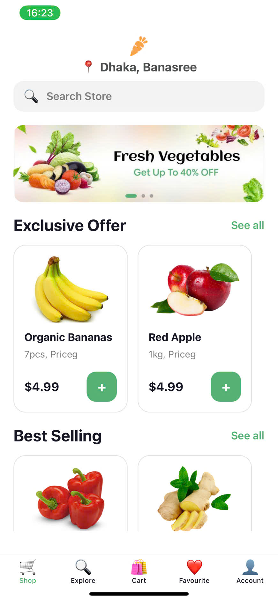
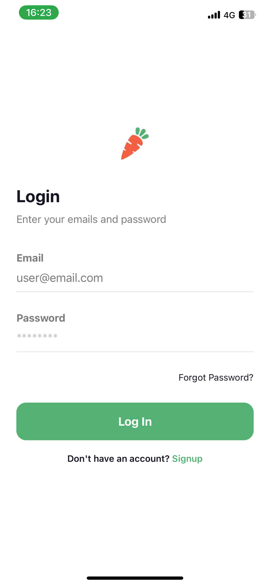
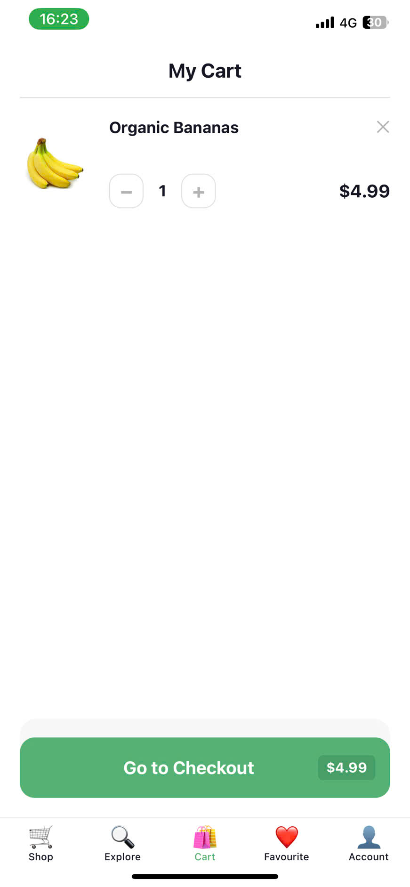
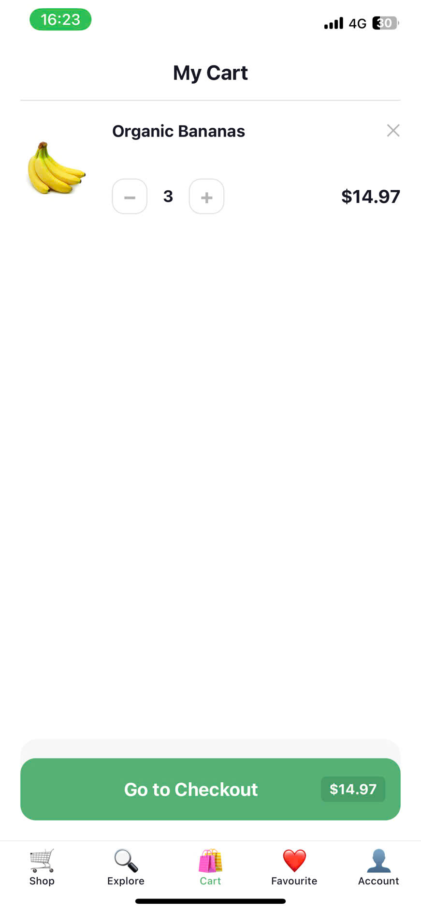
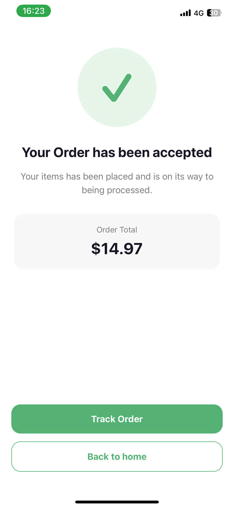
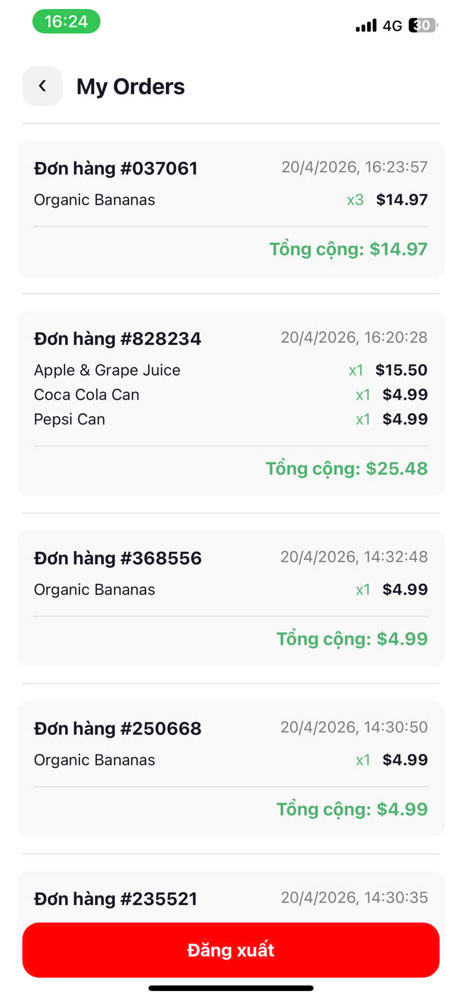
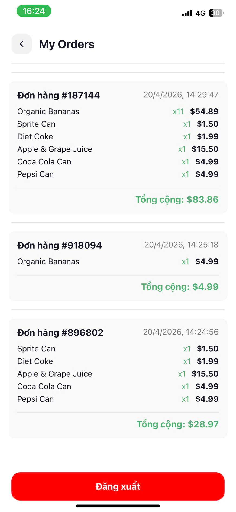

## Thông tin sinh viên
- Họ và tên: Đinh Thế Hiển
- Mã sinh viên: 23810310283
## Kết quả
<<<<<<< HEAD
=======
## Hình ảnh minh họa

>>>>>>> 634083ee4244f1d7582e741fe8b54de20e02472f
## Kết quả thực hiện (Demo)

<table>
  <tr>
    <td> Mô tả ảnh 1</td>
    <td> Mô tả ảnh 2</td>
  </tr>
  <tr>
    <td> Mô tả ảnh 3</td>
    <td> Mô tả ảnh 4</td>
  </tr>
  <tr>
    <td> Mô tả ảnh 5</td>
    <td> Mô tả ảnh 6</td>
  </tr>
  <tr>
    <td> Mô tả ảnh 7</td>
    <td> Mô tả ảnh 8</td>
  </tr>
  <tr>
    <td colspan="2" align="center"> Mô tả ảnh 9</td>
  </tr>
</table>
<<<<<<< HEAD
=======

>>>>>>> 634083ee4244f1d7582e741fe8b54de20e02472f
## Câu hỏi
 1. Cơ chế của AsyncStorage
Là hệ thống lưu trữ dữ liệu Key-Value cục bộ, bất đồng bộ (async/await) trên bộ nhớ máy.
Chỉ lưu trữ dữ liệu dưới dạng Chuỗi (String).
Dữ liệu được duy trì vĩnh viễn kể cả khi tắt nguồn điện thoại, cho đến khi bị xóa thủ công bằng code hoặc gỡ ứng dụng.
 2. Tại sao chọn AsyncStorage thay vì State?
Sự tồn tại: State (RAM) sẽ bị xóa sạch ngay khi app bị tắt hoặc khởi động lại. AsyncStorage (Ổ cứng) giúp lưu giữ dữ liệu xuyên suốt các phiên làm việc.
Ứng dụng: State dùng cho các thao tác mượt mà trên giao diện; AsyncStorage dùng để lưu các thông tin quan trọng cần tái sử dụng như Token đăng nhập, Cài đặt người dùng hoặc Thời gian hoạt động cuối cùng.
 3. So sánh AsyncStorage và Context API
Về bản chất: AsyncStorage là "Kho chứa" (ổ cứng), còn Context API là "Ống dẫn" (truyền dữ liệu giữa các màn hình).
Về lưu trữ: Context API lưu trên RAM nên sẽ mất dữ liệu khi đóng app; AsyncStorage lưu trên thiết bị nên không bị mất.
Về hiệu năng: Context API giúp giao diện cập nhật ngay lập tức (Re-render) khi dữ liệu thay đổi; AsyncStorage chỉ là nơi lưu trữ thuần túy, không có khả năng tự cập nhật giao diện nếu không kết hợp với State.
## Video demo
https://drive.google.com/file/d/1ZlKYdQPhIemMWtFdK2HAJWLIzgDzmQky/view?usp=sharing
